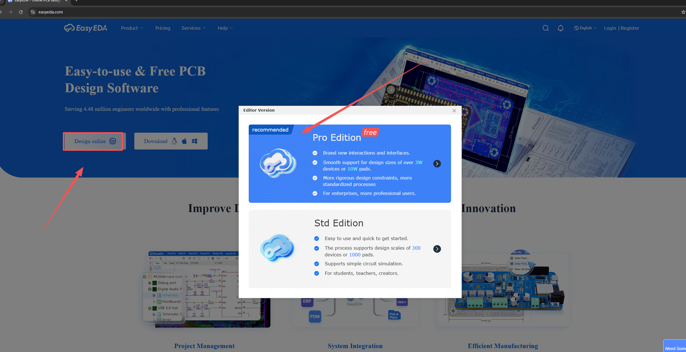
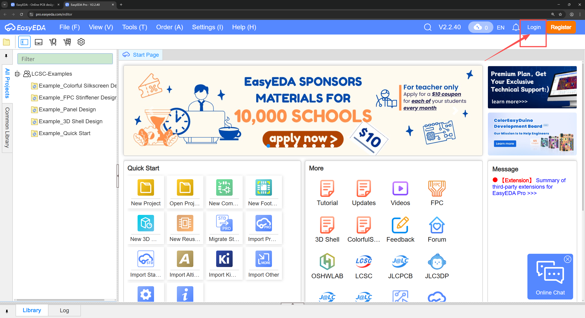
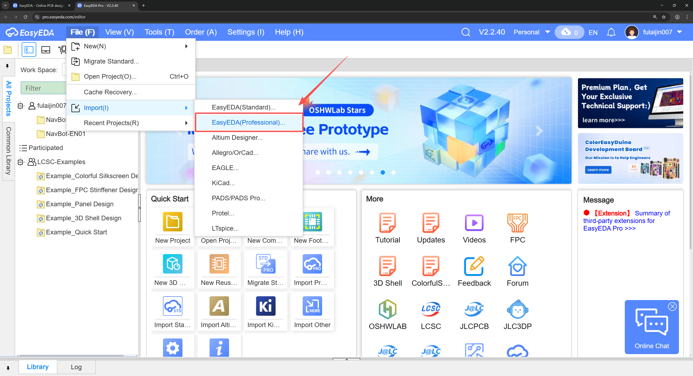

### Begin

1. visit website [https://www.easyeda.com](https://www.easyeda.com)
2. On the main page of the website, click "Design online" and select "Pro Edition"

    | Add libraries | 
    | ------------ |
    |  |

3. At this point, you need to log in.

    | Add libraries | 
    | ------------ |
    |  |
4. File->Import->JLCEDA(Professional), select NavBot-EN01.epro

    | Add libraries | 
    | ------------ |
    |  |