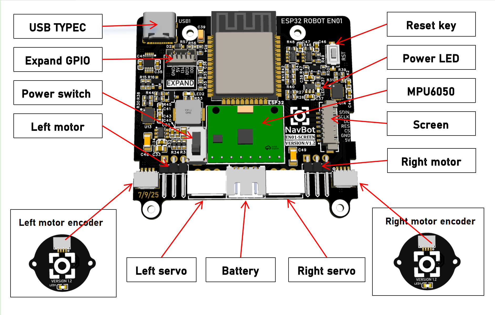
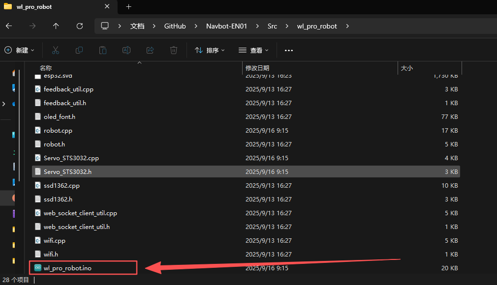
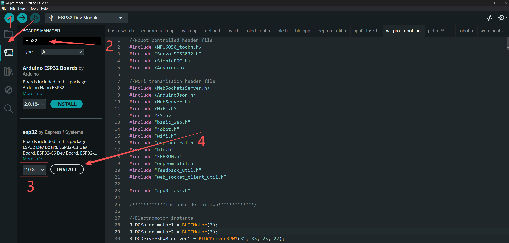
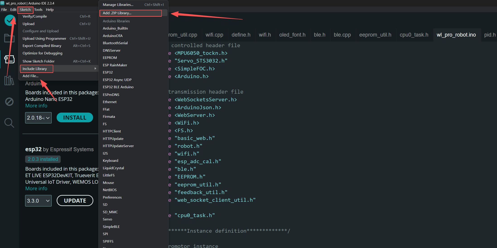
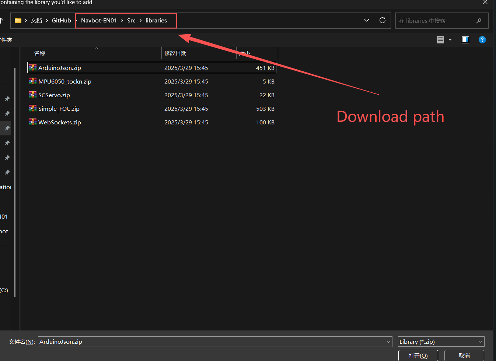
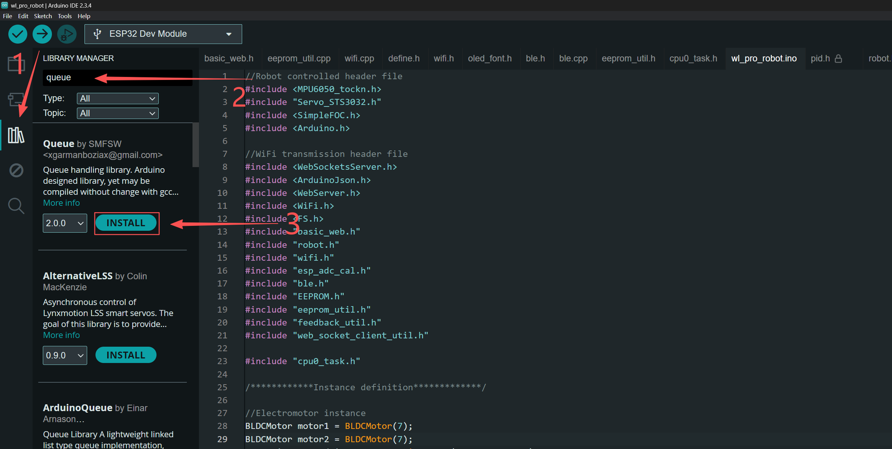
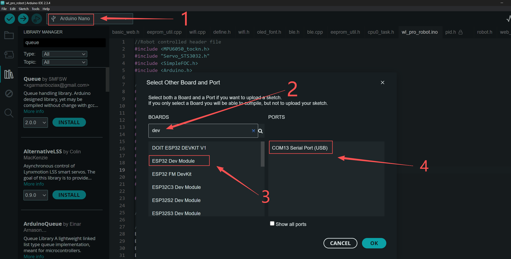
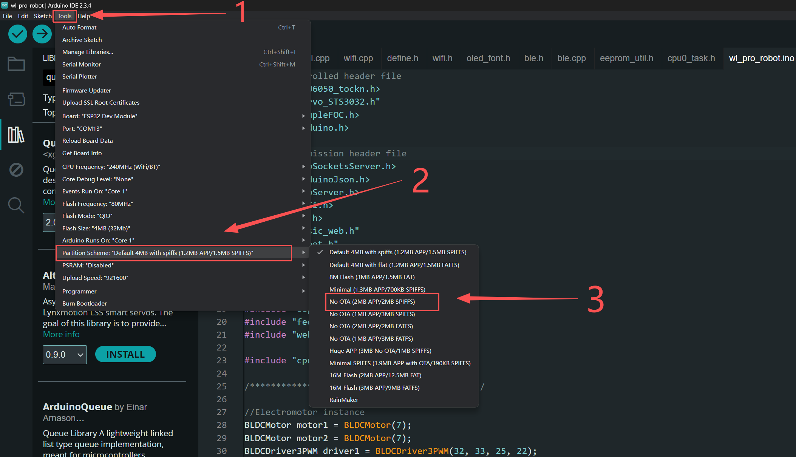

# NavBot-EN01 Wheeled_leg-Robot

| Real Robot        | 3D Design        |
| ------------ | ------------ |
|  |  |

[Physical Demo Showcase​](https://www.youtube.com/watch?v=H16f_6Kxv-E)  

[3D Demo Showcase​](https://www.youtube.com/watch?v=OKktbMr_LOk)  


### Mechanical Structure Documentation
Under the ["Hardware/RebotModel"](Hardware/RebotModel) folder:
* The file "OriginalRobotModel.stp" is the robot model file.
* 3D printing, carbon fiber cutting, and CNC processing can all directly use the files in the corresponding folders.
* In ["BOM.xlsx"](Hardware/RebotModel/BOM.xlsx), there are other small components that need to be purchased.

### PCB Documentation

* The project requires the fabrication of four PCBs. Both the schematic and PCB source files are provided, and the design environment used is [easyeda](https://www.easyeda.com/).
Import project reference ["Hardware/PCB/README"](Hardware/PCB/README.md)
* The main control board is based on the ESP32, with the brushless motor driver chip being the L6234PD013TR. 
* The encoder chip used is the AS5600, communicating with the main control board via the I2C interface.
* The IMU used is the MPU6050 module, which shares the same I2C interface with the right-side encoder.
* The servo debugging board combines two UART serial lines into one signal line using time-division multiplexing for data transmission and reception.
* Two SH1.0mm 4PIN double-ended cables which need to be purchased separately，with a recommended length of 15cm. 

    | Wire Connection | 
    | ------------ |
    |  |

### Source Code Usage

* Developed using the [Arduino IDE](https://www.arduino.cc/), which is user-friendly and widely adopted for embedded systems.
* The brushless motor drive for the wheels is based on [simpleFOC](https://www.simplefoc.com/#simplefoc_library).
* The left bus servo ID is 1, and the right is 2; the leg servo calibration value for achieving the mechanical limit in a fully squatted position is 2048; configuration is done using [FEETECH Debug Software](https://gitee.com/ftservo/fddebug).
* The [ESP32](https://www.espressif.com/sites/default/files/documentation/esp32_datasheet_en.pdf) itself has WiFi capabilities, with the webpage code stored in flash, transmitting JSON data via the WebSocket communication protocol.
* Please use the WebSocket library located in ["Src/libraries"](Src/libraries). The recommended esp32 version is 2.0.3.
* There are two WiFi models, AP mode and STA mode. AP mode uses the device as a wireless hotspot, and STA mode uses the device as a client to connect to an existing wireless network.
* Note: The WiFi band is 2.4GHz and cannot use the 5GHz band.

### The complete process of code compilation and download

1. Download and install [Arduino IDE](https://www.arduino.cc/), Recommend downloading Arduino IDE2。
2. Download the code of this repository.
3. After decompression, simply double-click the "Navbot-EN01/Src/wl_pro_robot/wl_pro_robot.ino" to open the project.

    | Open project | 
    | ------------ |
    |  |
4. Open the development board manager, search for esp32, select version 2.0.3, and click "Install".

    | Install the development package | 
    | ------------ |
    |  |
5. Click on "Sketch->Include library->Add.ZIP Library". Select the path "Navbot-EN01/Src/libraries/ArduinoJson.zip". Use the same method to add the remaining libraries as well.

    | Add libraries | 
    | ------------ |
    |  |
    |  |
6. Open the library manager, search for and download the "Queue" library.

    | Download queue library|
    | ------------ |
    |  |
7. Select the development board. In the search bar, search for "dev", select the ESP32 Dev Module, and choose the corresponding port. Note: If the machine is not connected, you don't need to select the port because there are no ports to choose from. The serial port numbers for each person may not be the same as the author's.

    | Select board |
    | ------------ |
    |  |
8. Change the partition scheme. The spiffs partition is currently used to store emoji files.
    | Modify the partition |
    | ------------ |
    |  |
9. Compile and download. Note: The first compilation may take a long time and is related to the computer configuration. The author's longest compilation time was 24 minutes.

### Implementation of expression function
* This version has achieved the function of expression linkage. This section mainly explains how to create expression files and upload them to the robot.

1. Prepare the document  
    Extract the Gif_to_Bin.zip file in the [Tools] folder. Then you will see a gif_to_bin.py script. At this point, it is recommended to place the GIF files to be converted in the same directory as the script. Next, you need to download Python 3 on your computer. After the download is complete, right-click and select Open in Terminal. Enter the following command 
    ```
    python .\gif_to_bin.py .\yourFile.gif 
    ```
    Then a "yourFile.bin" file will be generated, and this bin file will be uploaded to the esp32.

2. Upload files

    ESP32 stores emoji files in SPIFFS. For information on how to upload files to SPIFFS, please refer to this repository [https://github.com/me-no-dev/arduino-esp32fs-plugin](https://github.com/me-no-dev/arduino-esp32fs-plugin)。

    Unfortunately, Arduino IDE 2 does not support plugin functionality. Therefore, the author downloaded Arduino IDE 1 instead, which enables a more convenient file upload process. It is also important to note that when uploading the files, please ensure that the partition scheme used during the upload is the same as the one specified in the download procedure.


### Usage Instructions


1. Connect the battery's XH2.54 plug to the rear interface of the main control board and turn on the switch to power the robot.
2. A red light on the main board will indicate that the power is on.
3. The wheels will start FOC motor initialization, with the wheels moving slightly and the legs starting to move.
4. If the battery charge is sufficient, the blue LED on the main control board will light up. If it does not light up, charging is needed.
5. After this process is complete, press the EN button on the main control board to restart, and you can then connect to the robot's WiFi network starting with navbot_en01. The password is 12345678.
6. Open a browser connected to the robot's WiFi network and navigate to 192.168.1.11. The remote control interface is compatible with Android, iOS, Windows, Linux, macOS, etc., and it is recommended to use Chrome or Firefox.
7. Manually stabilize the robot, with the wheels slightly touching the ground. Click the "Robot go!" button on the web page, and the robot will stand up. You can then control the robot's movement using the joystick.

### Discord link
| Link: [https://discord.gg/cWGK4yER62](https://discord.gg/cWGK4yER62)        |
| :------------: |
|  |

### Guidance Viedeo & Blog
Video: [DIY Education Nano 01 - Modular Wheel-Leg Robot for STEM​](https://www.youtube.com/watch?v=cPD-h2ZjIqo)

Blog:  [Building a Tabletop Wheel-Legged Robot from Scratch​](https://frankfu.blog/embodied-ai-robot/building-a-tabletop-wheel-legged-robot-from-scratch/)  

Thanks for Mu Shibo & Li Yufeng：The original repository https://github.com/MuShibo/Micro-Wheeled_leg-Robot


